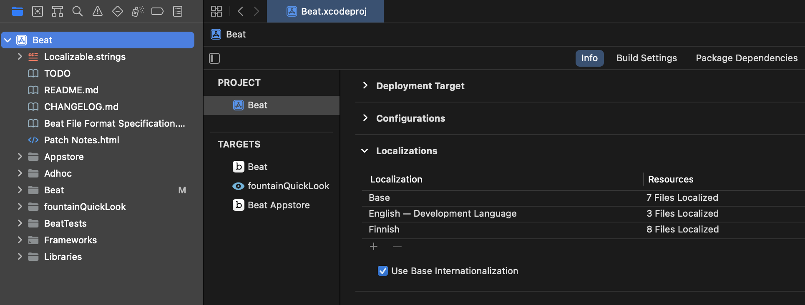
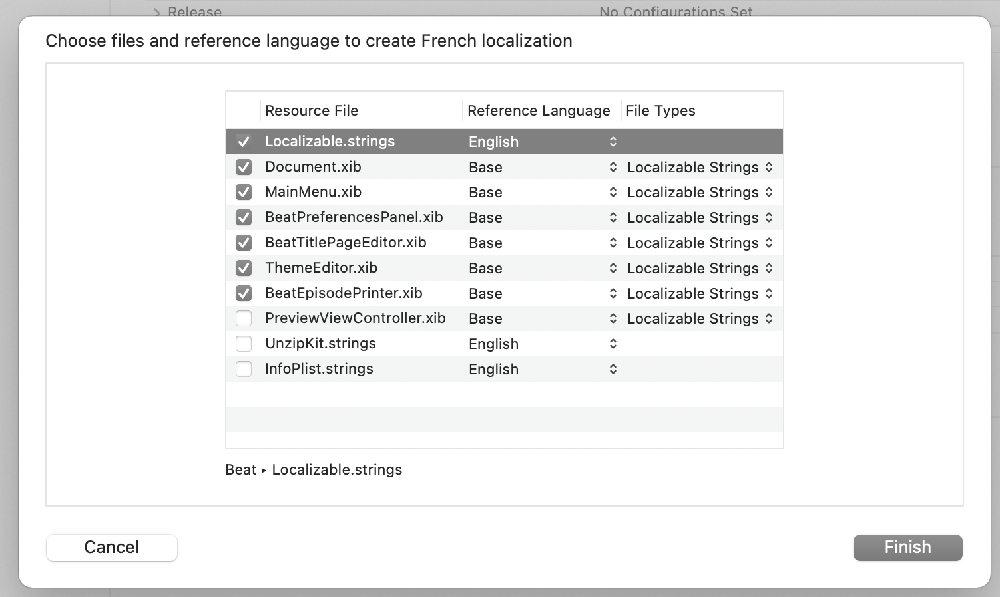

# Translation Guide

Thank you for your interest in making Beat more accessible to speakers of other languages! The following is a guide for translating everything in the app.

The best way to do this is with [Xcode](https://developer.apple.com/xcode/). Open `Beat.xcworkspace` with Xcode, and see the Info on the project as below:


The Localizations section will show the languages that the app currently supports. The base language is English. To add a new language, click on the plus sign. This will open the localization creation window:

Uncheck `PreviewViewController.xib`, `UnzipKit.strings`, and `InfoPlist.strings` as shown in the image above—those are not necessary. Within the Xcode project, these are the locations of the seven other files, which you must update to your contributed language:
- Beat ▸ Localizable.strings
- Beat ▸ Beat ▸ Document.xib
- Beat ▸ Beat ▸ MainMenu.xib
- Beat ▸ Beat ▸ User Interface ▸ Preferences ▸ BeatPreferencesPanel.xib
- Beat ▸ Beat ▸ User Interface ▸ Title Page Editor ▸ BeatTitlePageEditor.xib
- Beat ▸ Beat ▸ User Interface ▸ Themes ▸ Theme Editor ▸ ThemeEditor.xib
- Beat ▸ Beat ▸ Export ▸ BeatEpisodePrinter ▸ BeatEpisodePrinter.xib
For each file, choose the existing language that you would like to use as reference when translating terms in all the files.

Click Finish. The STRINGS files corresponding to the newly-added language will be created under the XIB directories.

These are the files that you must edit. Their paths from the repo directory in the file system are
- `[lang].lproj/Localizable.strings`
- `Beat/[lang].lproj/Document.strings`
- `Beat/[lang].lproj/MainMenu.strings`
- `Beat/User Interface/Preferences/[lang].lproj/BeatPreferencesPanel.strings`
- `Beat/User Interface/Title Page Editor/[lang].lproj/BeatTitlePageEditor.strings`
- `Beat/User Interface/Themes/Theme Editor/[lang].lproj/ThemeEditor.strings`
- `Beat/Export/BeatEpisodePrinter/[lang].lproj/BeatEpisodePrinter.strings`
where `[lang]` is the corresponding two-letter language code.

The contents of each STRINGS file will look like the following:
```
/* Class = "NSToolbarItem"; label = "General"; ObjectID = "2No-Jf-9GH"; */
"2No-Jf-9GH.label" = "General";

/* Class = "NSToolbarItem"; paletteLabel = "General"; ObjectID = "2No-Jf-9GH"; */
"2No-Jf-9GH.paletteLabel" = "General";

/* Class = "NSMenuItem"; title = "US Letter"; ObjectID = "3O7-zn-jUw"; */
"3O7-zn-jUw.title" = "US Letter";

/* Class = "NSButtonCell"; title = "Automatic paragraph breaks"; ObjectID = "5Bc-al-gWv"; */
"5Bc-al-gWv.title" = "Automatic paragraph breaks";

/* Class = "NSMenuItem"; title = "A4"; ObjectID = "7Xj-J1-Y92"; */
"7Xj-J1-Y92.title" = "A4";
```
The values outside of the comments (enclosed between `/*` and `*/`) will be in the reference language that you selected. These are the values for you to edit.

Make sure that your translations are accurate!